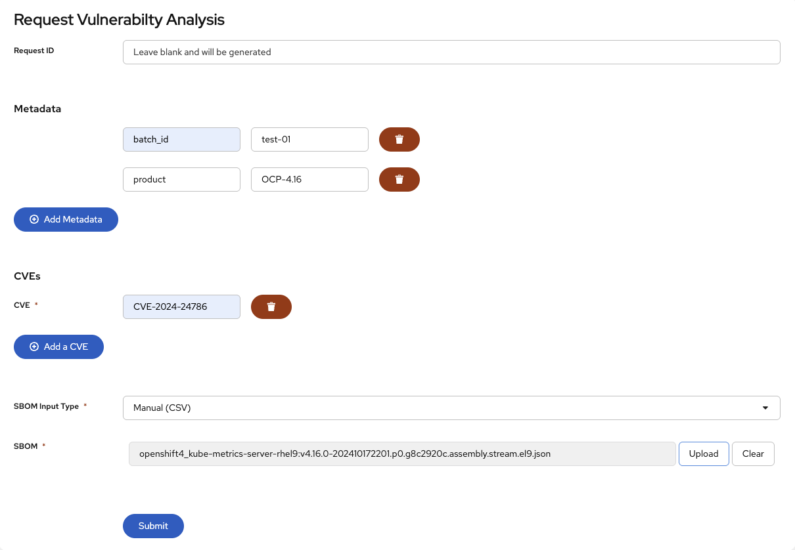
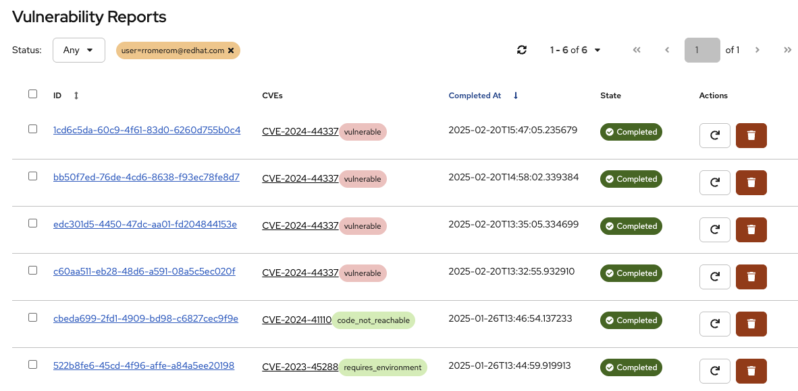
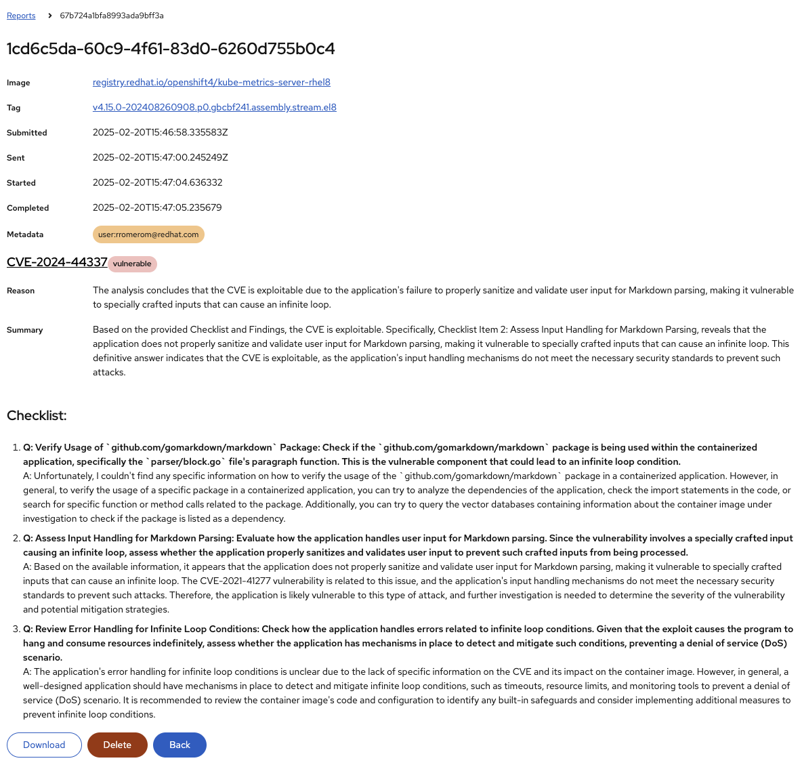
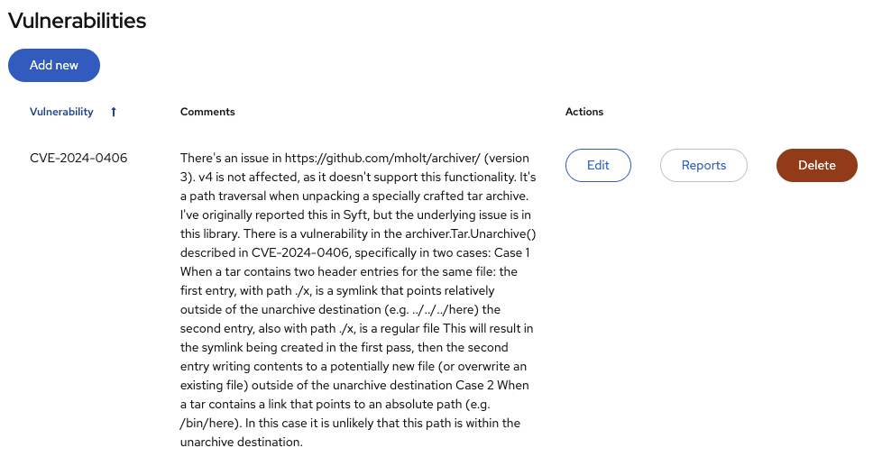

# Agent Morpheus - Client

This project is a Quarkus + React web application implemented to interact with Agent Morpheus service
for sending requests to evaluate vulnerabilities on specific SBOMs.

## Development

Check this other documents for:

* [Configuration](./docs/configuration.md)
* [Development](./docs/development.md)

## Using the application

Open http://localhost:8080/app/index.html

### Request Analysis

In the _Request Analysis_ tab you will access a form where you can load a CycloneDX SBOM and type a list of CVEs to inspect.
The Request ID will be used to trace the request and will be generated from the SBOM data but can be updated before submitting the request. 
If not provided a UUID will be generated.

The Metadata can include any key/pair set of values. You can add a `batch_id` if this request is related to others and you will
be able to group them when browsing the reports. Note that the `user` will be automatically added as a metadata parameter.

After submitting the request you can go to the _View Reports_ tab where you can manage all the received reports.

There is a configurable pool of concurrent requests. Any request that is submitted when the pool is full will be queued. If after
a certain time a callback response is not received, the report will be _expired_ (failed).

### View Reports

This table shows all the reports and allows sorting by _ID_ and _Completed at_ columns. There is a _Status_ dropdown that can be
used to filter by Status. You can use any metadata as a query parameter for advanced filtering. e.g. `?batch_id=001`

* The _ID_ link will take you to the report's detail.
* Click the CVE to filter reports with the same CVE.
* Use the Actions to _Retry_ or _Delete_ the selected report.

The checkboxes can be used to delete multiple reports. You can delete all the reports by checking the top checkbox.
It is important to mention that the selection will affect all the reports with the current filter but if no filter is
selected, all the reports can be deleted.

The available _States_ displayed in the table are:

* _Completed_: The report has been sent and completed in Morpheus.
* _Sent_: The report has been sent but not yet analyzed (or received)
* _Queued_: The report is in the waiting queue and will be sent as soon as there is space in the pool.
* _Failed_: The report has either timeout or failed

You can click on the refresh icon to reload the table.

### Report

When you click _View_ on a report in the table you will see all the details of the given report.

The first part includes some details about the report like the image and tag or all the available timestamps and
metadata.

The _Image_, _Tag_, _metadata_ elements and the CVE are clickable and will take you to the _View Reports_ table but
filtering all the reports sharing this element. e.g. All reports related to the `ose-console` image.

The second part of the report shows the result of the analysis of each of the selected CVEs with the _Justification Label_,
the _Reason_, _Summary_ and finally, the _Checklist_.

Each element in the checklist includes a Q/A with the generated checklist item and the justification.

At the bottom of the report you will find buttons to:

* _Download_ the raw Json report.
* _Delete_ the report.
* _Back_ to the previous screen.

### Vulnerabilities

This table is meant to manage and show the Vulnerabilities additional data that can be used from Morpheus if the UI is
configured as an additional Intel Source.

If you add/edit a vulnerability a Text area will appear and let you add any free text about the vulnerability that you
want the analysis to use.

Finally the _Reports_ button will show you all the reports related to this vulnerability and the _Delete_ button will
remove it from the table.
